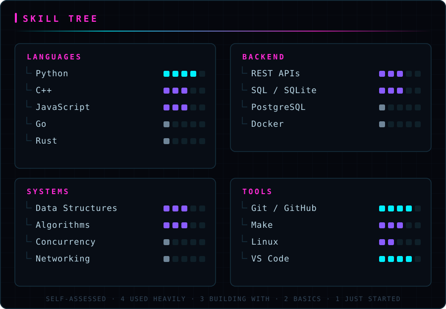
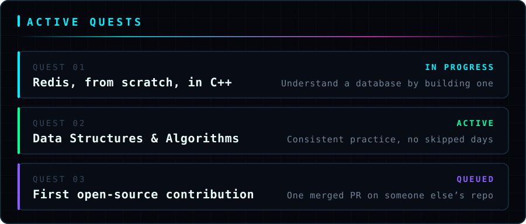
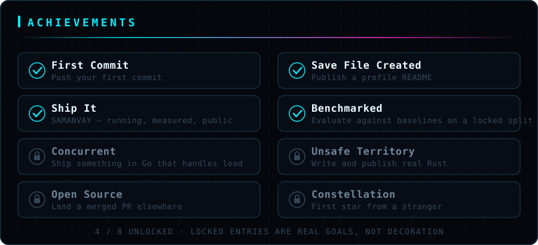
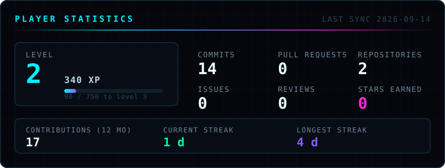
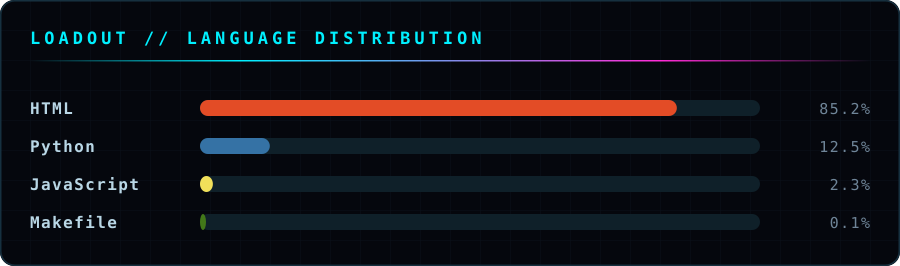

<div align="center">


<br>



</div>

## ▍ MISSION BRIEFING

> Early in my developer journey, building in public from day one.
> Right now I'm rebuilding Redis from scratch in C++ — because reading
> about how a database server works is not the same as making one run.
> Alongside it: DSA practice, and full-stack web with React and Node.
> I learn by rebuilding things I'd actually use rather than following
> tutorials to the end.

**Currently learning** — C++ systems programming · DSA · Backend (Node) · React
**Open to** — internships · hackathon teams · open-source collaboration

<div align="center">



</div>

## ▍ LOADOUT

<div align="center">


<br>



<br>



</div>

## ▍ FEATURED MISSIONS

> No missions published yet. Act I is in progress — current work is in the
> quest log above. This section fills in as projects ship.

<div align="center">



<br>



<br>


</div>

<details>
<summary><b>How the level is calculated</b> — no fake numbers here</summary>

<br>

LEVEL and XP are computed from live GitHub API data by
[`scripts/build-hud.mjs`](./scripts/build-hud.mjs), using a published formula:

```
XP     = commits×10 + PRs×50 + issues×25 + reviews×40 + repos×100 + stars×75
LEVEL  = floor( sqrt( XP / 250 ) ) + 1
```

Every figure comes from GitHub's GraphQL API and is regenerated daily by a
scheduled Action. Nothing is hand-written and nothing is inflated. The curve is
quadratic, so early levels come fast and later ones cost real work — same as any
RPG worth playing.

The static panels above are generated too, from a single content block in
[`scripts/build-panels.mjs`](./scripts/build-panels.mjs). Edit the data, re-run
the script, and every panel redraws.

</details>

## ▍ TRANSMISSION

<div align="center">

[](https://github.com/aditya-dixitt)
[](https://www.linkedin.com/in/aditya-dixit-1140a53b9/)
[](https://leetcode.com/u/adityadixit1127/)
[](mailto:adityadixit.1127)


<br>

<sub>`SESSION ACTIVE` · `AUTOSAVE ENABLED` · every panel in this profile was built by hand</sub>

</div>
