<div align="center">




</div>

---

## ▍ PLAYER PROFILE

```
┌──────────────────────────────────────────────────────┐
│  PLAYER      aditya-dixitt                           │
│  CLASS       Software Developer                      │
│  ORIGIN      Pune                                    │
│  STATUS      GRINDING                                │
│  CAMPAIGN    Act I - foundations                     │
│  MISSION     Rebuilding Redis from scratch in C++    │
└──────────────────────────────────────────────────────┘
```

<details>
<summary><b>How the level is calculated</b> — no fake numbers here</summary>

<br>

The LEVEL and XP in the stats panel are computed from real GitHub API data by
[`scripts/build-hud.mjs`](./scripts/build-hud.mjs), using a published formula:

```
XP     = commits×10 + PRs×50 + issues×25 + reviews×40 + repos×100 + stars×75
LEVEL  = floor( sqrt( XP / 250 ) ) + 1
```

Every number is pulled live from GitHub's GraphQL API and regenerated daily by a
GitHub Action. Nothing is hand-written, and nothing is inflated. The curve is
quadratic, so early levels come fast and later ones cost real work — same as
any RPG worth playing.

</details>

---

## ▍ MISSION BRIEFING

> Early in my developer journey, building in public from day one.
> Right now I'm rebuilding Redis from scratch in C++ — because reading
> about how a database server works is not the same as making one run.
> Alongside it: DSA practice, and full-stack web with React and Node.
> I learn by rebuilding things I'd actually use rather than following
> tutorials to the end.

**Currently learning** — C++ systems programming · DSA · Backend (Node) · React
**Open to** — internships · hackathon teams · open-source collaboration
